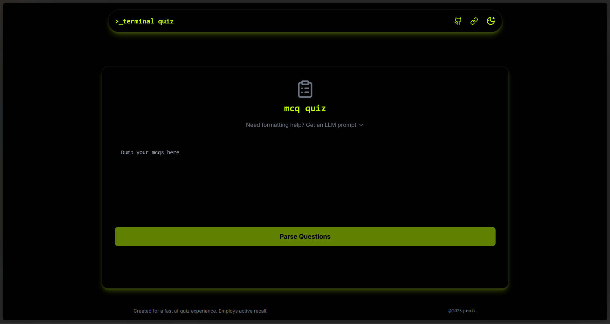
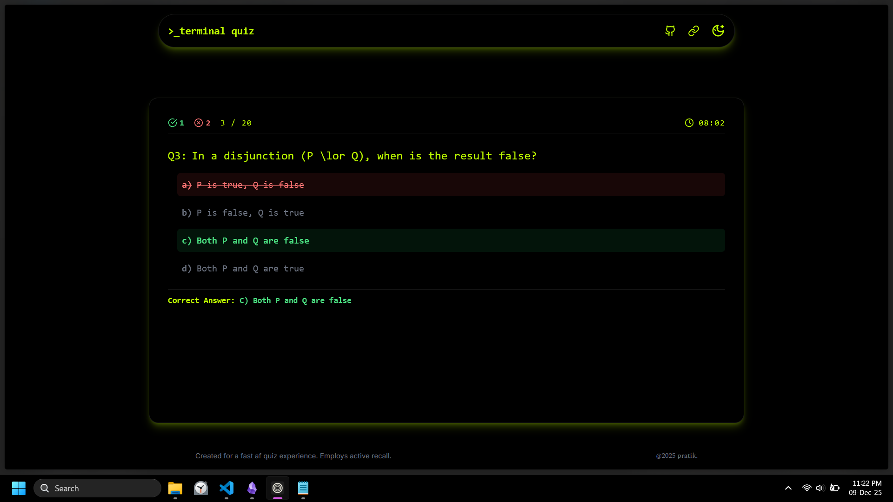

Quiz maker off llm generated mcqs.

Ever had a environmental sciences quiz the next day and the only material you have on you is a 400 page pdf?
The first plan of action seems to be to upload it to a llm and generate 100s of mcqs. But passive reading just leads to blanking out on the next day.
To circumvent that:
this website quizzes you on them, helps you employ active recall so that the info sticks long term(at least until your exam)

It exists just to curb that small utility >_<

Features:
1. timer
2. export of incorrect questions in a .md file
3. interface designed to be fast paced(no need to take your hands off the keyboard)
4. robust regex logic(since the llm is bound to mess up the formatting somehow)